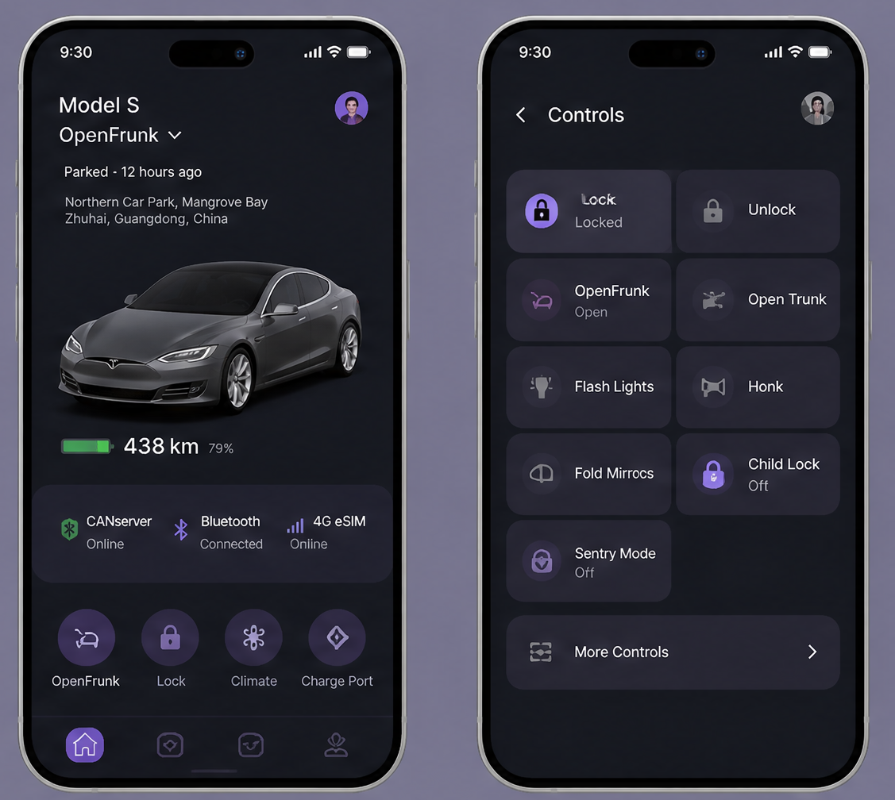
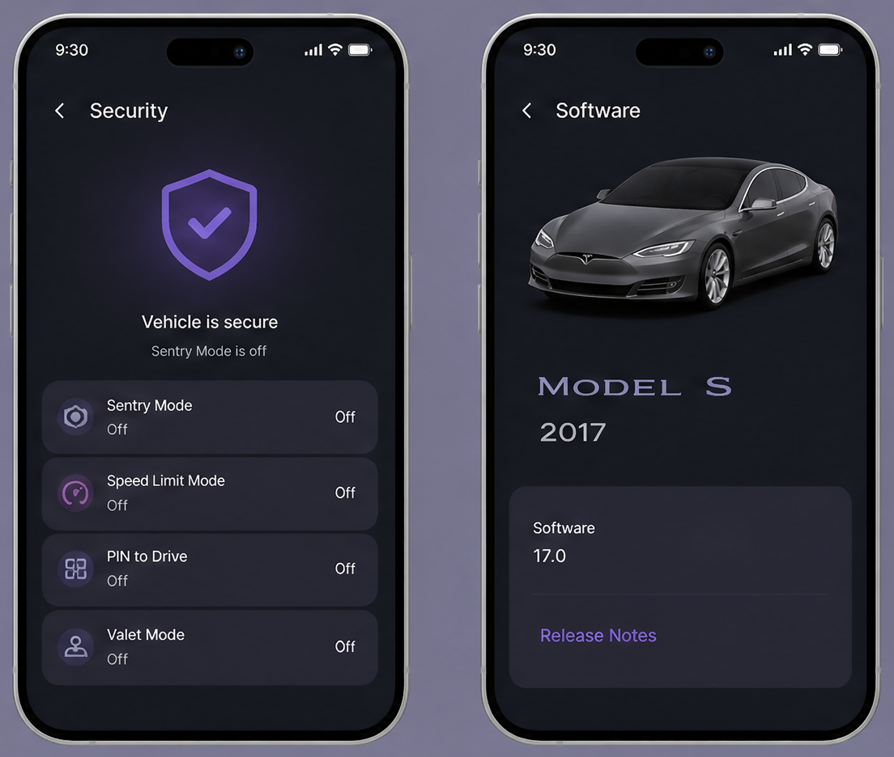
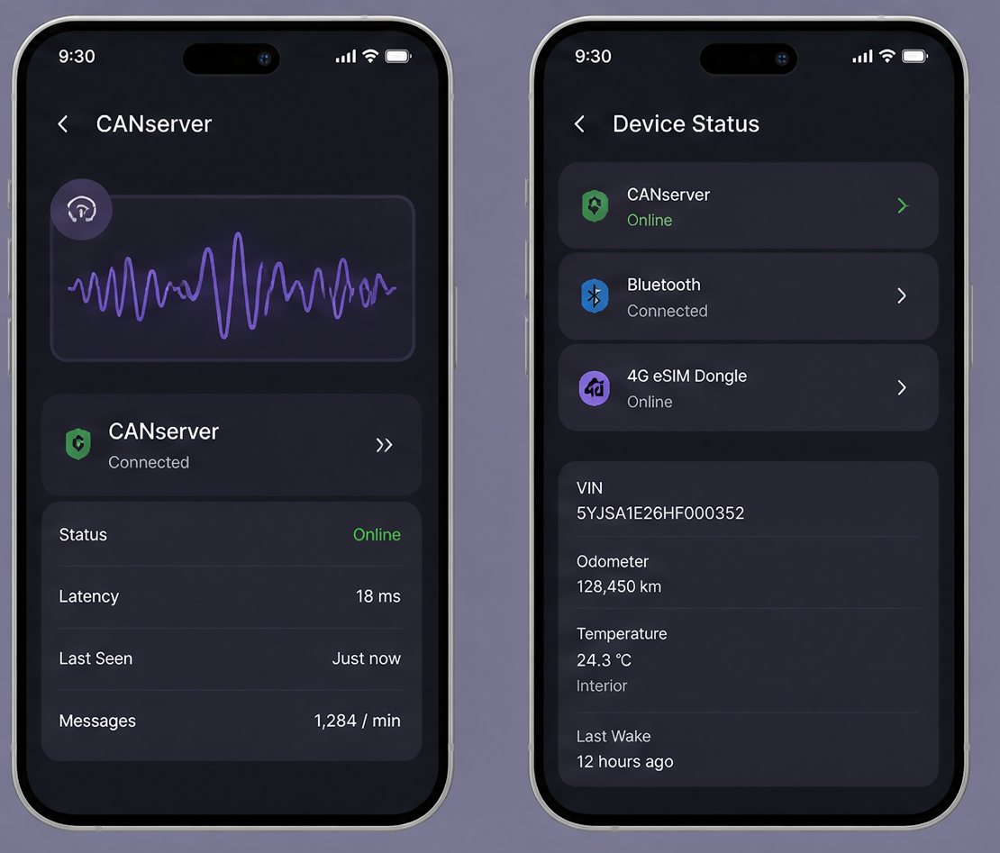
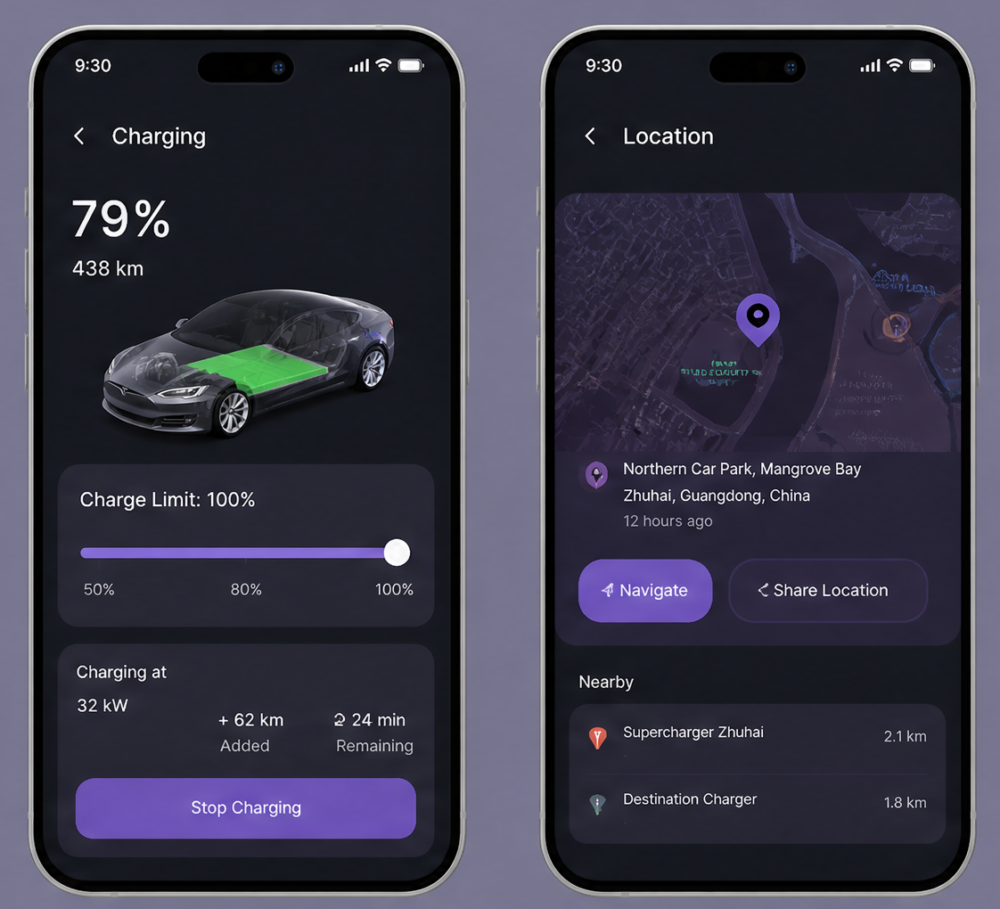
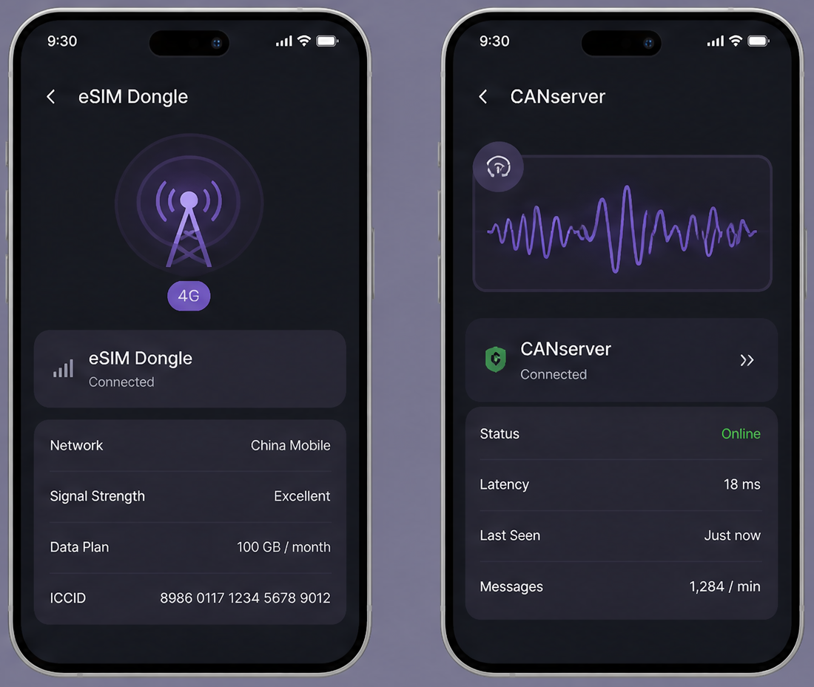
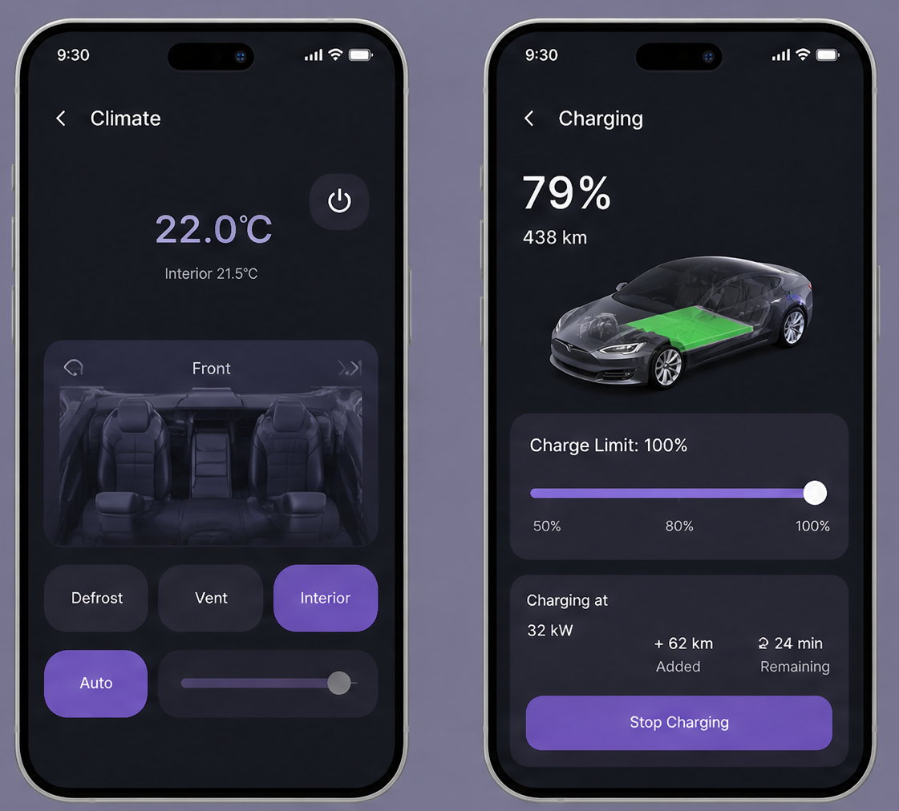

# 🚗 Tesla CANServer MyRemote

> **Self-hosted CAN bus server for Tesla Model S (pre-2021)**  
> Orange Pi 4 Pro + CANable 2.0 USB-CAN + Flask REST API + Tailscale P2P

<p align="center">
  
  
  
  
  
  
  
</p>

<p align="center">
  <b><i>★ Let your Tesla always in control ★</i></b>
</p>

> ⚠️ **CAUTION** — **Unfinished prototype.** NOT production-ready. Use at your own risk. 🚧  
> 📅 Estimated completion: ~3 months. Hardware BOM and wiring guide coming soon.

<p align="center">
  <table>
    <tr>
      <td width="33%" align="center"></td>
      <td width="33%" align="center"></td>
      <td width="33%" align="center"></td>
    </tr>
    <tr>
      <td width="33%" align="center"></td>
      <td width="33%" align="center"></td>
      <td width="33%" align="center"></td>
    </tr>
    <tr>
      <td colspan="3" align="center"></td>
    </tr>
  </table>
</p>

> **[ English ](#english)** · **[ 简体中文 ](#简体中文)** · **[ 日本語 ](#日本語)** · **[ 한국어 ](#한국어)**

---
> **[ English ](#english)** · **[ 简体中文 ](#简体中文)** · **[ 日本語 ](#日本語)** · **[ 한국어 ](#한국어)**


<a name="english"></a>
## 🇺🇸 English

## 📋 Overview

<table>
<tr>
  <td width="33%" align="center">
    <h3>⚡ Control</h3>
    Lock/unlock · Frunk/trunk ·<br>
    Lights · Horn · Windows ·<br>
    HVAC · Charge port¹ · Mirrors · NFC
  </td>
  <td width="33%" align="center">
    <h3>📊 Monitor</h3>
    Battery SoC · Range ·<br>
    Diagnostics (CAN/BT/4G) ·<br>
    VIN decoder · Tesla model DB
  </td>
  <td width="33%" align="center">
    <h3>🔗 Connect</h3>
    Tailscale P2P · DDNS ·<br>
    WiFi · BLE · NFC card ·<br>
    4G always-on
  </td>
</tr>
</table>

<table>
<tr>
  <td width="50%" align="center">
    <h3>📱 App Platforms</h3>
    🌐 <b>Web App (PWA)</b> — Live now<br>
    🍎 <b>iOS App</b> — 🔜 Sideload IPA<br>
    🤖 <b>Android APK</b> — 🔜 Download & install
  </td>
  <td width="50%" align="center">
    <h3>🛠️ Hardware</h3>
    🍊 Orange Pi 4 Pro (6GB)<br>
    🔌 CANable 2.0 USB-CAN<br>
    📡 4G USB Modem · 💳 NFC Reader
  </td>
</tr>
</table>

---

## 🚀 Quick Start

### 1. Flash Orange Pi OS to SD Card

Download the official image and flash to a microSD card (16GB+):

| Download | Link |
|----------|------|
| 🍊 Orange Pi OS 1.0.6 Jammy Server | [orangepi.org/download](http://www.orangepi.org/html/hardWare/computerAndMicrocontrollers/service-and-support/Orange-Pi-4-Pro.html) |
| 🔧 Balena Etcher (flash tool) | [balena.io/etcher](https://www.balena.io/etcher) |

1. Insert microSD into your computer
2. Open Balena Etcher → select the `.img.xz` file → select SD card → **Flash!**
3. After flashing, insert SD card into Orange Pi and power on
4. Find the Pi IP: check your router DHCP list, or scan with `arp -a`

> 📦 **Pre-flashed image** — A ready-to-boot SD card image with everything pre-installed will be available for download once the project nears completion. Stay tuned.

### 2. One-Click Install

```bash
curl -fsSL https://raw.githubusercontent.com/monah-studio/\
Tesla-CANServer-MyRemote/main/setup.sh | sudo bash
```

Or download the [latest release](https://github.com/monah-studio/Tesla-CANServer-MyRemote/releases/latest) and run:

```bash
sudo bash setup.sh
```

The script auto-detects your hardware, installs dependencies, pulls the latest server code, and configures remote access.

### 3. Manual Install

```bash
git clone https://github.com/monah-studio/Tesla-CANServer-MyRemote.git
cd Tesla-CANServer-MyRemote/app
python3 -m venv venv && source venv/bin/activate
pip install flask flask-cors python-can
python server.py
```

Open `http://[pi-ip]:5000` in your browser.

---

## 🌐 Network Options

<table>
<tr>
  <th width="25%">Method</th>
  <th width="25%">User needs</th>
  <th width="25%">Works with VPN?</th>
  <th width="25%">Setup</th>
</tr>
<tr>
  <td><b>☁️ Cloudflare Tunnel</b> 🥇</td>
  <td>Nothing — just browser</td>
  <td align="center">✅</td>
  <td><code>setup.sh</code> → option 1</td>
</tr>
<tr>
  <td><b>🔗 Tailscale</b></td>
  <td>Install Tailscale</td>
  <td align="center">❌</td>
  <td><code>setup.sh</code> → option 2</td>
</tr>
<tr>
  <td><b>🏠 LAN (WiFi)</b></td>
  <td>Same network</td>
  <td align="center">✅</td>
  <td>No tunnel needed</td>
</tr>
<tr>
  <td><b>📶 Bluetooth (BLE)</b></td>
  <td>Nothing — auto-discover</td>
  <td align="center">✅</td>
  <td>Pi broadcasts beacon</td>
</tr>
</table>

### ☁️ Cloudflare Tunnel (Recommended)

No open ports, no public IP, no VPN. The Pi makes one outbound HTTPS connection.

```
Phone (any network, any VPN)     Cloudflare Edge           Orange Pi (4G)
         │                              │                       │
         │  tesla.yourdomain.com        │  cloudflared tunnel   │
         ├─────────────────────────────►│◄──────────────────────┤
         │◄───────── JSON response ─────┤                       │
```

### 🔗 Tailscale

```
Phone (Tailscale)              Tailscale P2P              Orange Pi (Tailscale)
         │                              │                       │
         │◄─────── WireGuard tunnel ─────►                       │
```

Simple, but users must install Tailscale and it conflicts with other VPNs.

### 📶 Bluetooth (BLE)

```
Phone (any browser)          BLE beacon              Orange Pi 4 Pro
         │                              │                       │
         │  Tap "Scan" in app           │  Advertises IP        │
         ├─────────────────────────────►│◄──────────────────────┤
         │◄──── BLE provides IP ────────┤                       │
         │────── HTTP request ────────────────────────────────►│
```

No setup needed. Orange Pi broadcasts a BLE beacon (`TeslaControl-` prefix) containing its IP address. Phone's Web Bluetooth auto-discovers nearby vehicles.

---

## 📱 App Platforms

> **Web App** (PWA) — works instantly in any browser.
> Native **iOS App** and **Android APK** coming — download and install directly.

| Platform | Status | How to Access |
|----------|--------|--------------|
| 🌐 **Web App (PWA)** | ✅ Live | `http://[Pi-IP]:5000` or `https://your-ddns.com:5000` |
| 🍎 **iOS App** | 🔜 Planned | IPA sideload via AltStore |
| 🤖 **Android APK** | 🔜 Planned | Download from GitHub Releases |

---

## 🎮 API Reference

### ⚡ Control Commands (16)

| Method | Endpoint | Description | CAN ID | Status |
|--------|----------|-------------|:------:|:------:|
| `POST` | `/api/lock` | 🔒 Lock all doors | `0x216` | ✅ |
| `POST` | `/api/unlock` | 🔓 Unlock all doors | `0x216` | ✅ |
| `POST` | `/api/frunk` | 🚘 Open front trunk | `0x217` | ✅ |
| `POST` | `/api/trunk` | 🚙 Open rear trunk | `0x218` | ✅ |
| `POST` | `/api/flash_lights` | 💡 Flash exterior lights | `0x244` | ✅ |
| `POST` | `/api/honk` | 📯 Honk horn | `0x245` | ✅ |
| `POST` | `/api/windows_vent` | 🪟 Vent windows | `0x215` | ✅ |
| `POST` | `/api/windows_close` | 🪟 Close windows | `0x215` | ✅ |
| `POST` | `/api/charge_port_open` | 🔌 Open charge port | `0x312` | 🔜 Need verification |
| `POST` | `/api/charge_port_close` | 🔌 Close charge port¹ | `0x312` | 🔜 Need verification |
| `POST` | `/api/mirrors_fold` | 🪞 Fold side mirrors | `0x210` | 🔜 Need verification |
| `POST` | `/api/mirrors_unfold` | 🪞 Unfold side mirrors | `0x210` | 🔜 Need verification |
| `POST` | `/api/interior_lights_on` | 🔦 Interior lights on | `0x240` | 🔜 Need verification |
| `POST` | `/api/interior_lights_off` | 🔦 Interior lights off | `0x240` | 🔜 Need verification |
| `POST` | `/api/hvac_on` | ❄️ HVAC on | `0x302` | 🔜 Need verification |
| `POST` | `/api/hvac_off` | ❄️ HVAC off | `0x302` | 🔜 Need verification |

> ✅ = Code implemented and deployed. CANable hardware required to test on vehicle.
> 🔜 = Code implemented, CAN IDs from community databases — vehicle testing pending.
>
> ¹ **Close charge port** only works on **2016+ Model S/X**. Pre-2016 vehicles (including the 2015 85D) use a mechanical latch that cannot be commanded via CAN. Use NFC trigged shortcut as workaround.

### 📊 Status & Data

| Method | Endpoint | Description |
|--------|----------|-------------|
| `GET` | `/api/ping` | Health check |
| `GET` | `/api/status` | Full vehicle status (SoC, gear, speed, charge) |
| `GET` | `/api/diagnostics` | System: CAN, 4G, Bluetooth, Internet, Tailscale |
| `POST` | `/api/decode-vin` | Decode VIN → model, year, battery, range |
| `GET` | `/api/models` | All 39 Tesla models in database |
| `GET` | `/api/config/all` | Colors, wheels, MCU, interior, body styles |

### `GET /api/status` Example

```json
{
  "connected": true,
  "battery_soc": 75,
  "gear": "P",
  "speed_kmh": 0,
  "charge_port": { "state": "CLOSED", "charging": false }
}
```

---

## 🧱 Project Structure

```
Tesla-CANServer-MyRemote/
├── app/
│   ├── server.py           # Flask REST API
│   ├── tesla_can.py        # CAN bus driver (socketcan)
│   ├── tesla_models.py     # 39 Tesla models + VIN decoder
│   ├── nfc.py              # NFC card reader daemon
│   └── static/
│       ├── index.html      # 📱 Main PWA: control panel
│       └── dashboard.html  # 📊 Battery analytics (React)
├── network/
│   ├── setup_4g_modem.sh   # 4G/5G configuration
│   ├── setup_network.sh    # Tailscale + DDNS + BLE
│   └── setup_data_stack.sh # Grafana + InfluxDB + Tunnel
├── setup.sh                # One-click installer
├── wiring.md               # Hardware wiring guide
└── assets/                 # Screenshots and images
```

---

## 📅 Timeline

> ⏳ **Estimated completion: ~3 months remaining.**
> Prototype in active development. CANable 2.0 ordered for testing.
> Hardware BOM and detailed wiring guide coming once vehicle-verified.

---

## 🗺️ Roadmap

### Phase 1 — Core Control (Current) 🚧
**Vision:** Replace Tesla's official server with your own local CAN bus controller. Every button your phone sends becomes a wire-level CAN command within milliseconds.

**Tech:**
- CANable 2.0 (candleLight firmware → gs_usb native socketcan)
- Python `python-can` library with 125 kbps Body CAN (BCAN)
- Flask REST API for all vehicle endpoints
- NFC card reader via pyscard + ACR122U/PN532
- CAN ID reverse-engineering from 2015 Model S 85D

**Problems to solve:**
- CAN ID database is incomplete — many commands (windows, sunroof, HVAC) need sniffing
- CANable 2.0 with candleLight gs_usb driver can drop frames under load
- NFC card UID → CAN command mapping requires hardware handshake timing (< 100ms response to feel instant)
- Orange Pi kernel (5.15.147-sun60iw2) doesn\'t ship socketcan by default; needs manual modprobe gs_usb

| Item | Status |
|------|:------:|
| CAN bus communication (CANable 2.0) | 🔜 Hardware ordered |
| Vehicle body control (lock, unlock, frunk, trunk) | ✅ Code ready, needs hardware |
| Lights, horn, windows control | ✅ Code ready, needs hardware |
| HVAC, charge port, mirrors control | ✅ Code ready, needs vehicle verification |
| NFC card reader — simulate Model 3/Y phone key | 🔜 Needs USB PN532/ACR122U hardware |
| Real-time CAN data streaming to InfluxDB | 🔜 Coming |

---

### Phase 2 — Analytics & Monitoring 📊
**Vision:** Turn 2015 Model S into a data-generating lab. Historical battery degradation curves, driving efficiency breakdowns, pre-emptive fault warnings — all drawn from real CAN data.

**Tech:**
- Telegraf → InfluxDB 2.7 (time-series pipeline already installed on Orange Pi)
- Grafana dashboards with React + Recharts overlay
- CAN DBC file parsing for battery cell voltages, temperatures, BMS states
- ML anomaly detection on recurring CAN errors (e.g. thermal runaway precursors)

**Problems to solve:**
- No CAN DBC exists for 2015 Model S — every signal must be reverse-engineered from raw frames
- Battery data is fragmented across BCAN + CHCAN; need to aggregate and timestamp-align two buses
- InfluxDB schema needs careful design to avoid cardinality explosion (each cell voltage is a unique series)
- Grafana panel query performance on 5M+ data points with sub-second refresh

| Item | Status |
|------|:------:|
| Battery SoC & health dashboard (React) | ✅ Built |
| Grafana dashboards for historical analysis | 🔜 Need real data |
| Driving efficiency analysis | 🔜 Need real data |
| Battery degradation tracking | 🔜 Post-launch |

---

### Phase 3 — Network & Access 🔗
**Vision:** Your car reachable from anywhere in the world — no port forwarding, no static IP, no VPN conflict. Four fallback methods so it never goes offline.

**Tech:**
- Cloudflare Tunnel (cloudflared) for zero-trust HTTPS ingress
- Tailscale P2P WireGuard for direct low-latency control
- DDNS via Namecheap for direct IP fallback (remote.openfrunk.com)
- BLE beacon advertisement (Eddystone-URL) for zero-config garage discovery
- 4G USB modem failover with ModemManager + NetworkManager

**Problems to solve:**
- Tailscale conflicts with corporate VPNs — user must toggle off to reach the car
- Cloudflare Tunnel adds ~100-200ms latency vs direct DDNS connection
- BLE beacon range on Orange Pi 4 Pro is only ~5-8m (metal car body attenuates signal)
- 4G modem auto-switch latency — cellular fallback takes 8-15 seconds during WiFi outage
- CF tunnel DNS routing: tesla.openfrunk.com CNAME → tunnel.app must be created in Cloudflare dashboard

| Item | Status |
|------|:------:|
| 4 connection modes (Tailscale / DDNS / WiFi / BLE) | ✅ All implemented |
| Cloudflare Tunnel support | ✅ Installed |
| Pre-flashed SD card image | 🔜 Near production |
| BLE beacon auto-discovery | 🔜 Coming |

---

### Phase 4 — Native Apps 📱
**Vision:** Apple Wallet tap-to-unlock on a 2015 Model S. Open your phone, tap the reader, car unlocks. Same UX as a 2024 Model 3 — on a 10-year-old car.

**Tech:**
- Apple HomeKit / HomeKey (NFC Type 2/4 tag emulation via HomeKit Accessory Protocol)
- iOS App Clip or PWA with background NFC polling
- Android HCE (Host Card Emulation) for Google Wallet / direct tap
- Capacitor.js or Swift/SwiftUI native wrappers for iOS connectivity
- Web Bluetooth / Web NFC APIs for zero-install web app access

**Problems to solve:**
- Apple HomeKey requires MFi certification and a HomeKit Accessory Protocol (HAP) chip — a USB PN532 cannot directly emulate a HomeKey credential without Apple\'s authentication chip (SE)
- Workaround: emulate an NFC tag that triggers a Shortcut, which then calls the REST API via web request (confirmed feasible on iOS 17+)
- Background NFC polling on iOS drains battery; user must intentionally tap the reader
- Android HCE requires a companion app with foreground priority; background card emulation is unreliable on some OEM ROMs
- PWA push notifications for urgent alerts (charge interrupted, alarm triggered) are not supported on iOS Safari

| Item | Status |
|------|:------:|
| PWA (current) | ✅ Live |
| iOS IPA sideload | 🔜 Planned |
| Android APK | 🔜 Planned |
| **Apple HomeKey (HomeKit) emulation as CarKey** | 🔜 Needs NFC + HomeKit-certified PN532 reader |

---

### Phase 5 — Production Release 🏁
**Vision:** A complete, documented, one-script-deployment system that anyone with a 2012-2020 Tesla and a CAN adapter can install in under 30 minutes. No coding, no terminal expertise, no Cloudflare account needed.

**Tech:**
- Pre-built Orange Pi Armbian image (.img.xz) with all services pre-installed
- One-line curl | bash installer (already scaffolded in setup.sh)
- HTML wiring guide with photos + pinout diagrams
- Docker Compose alternative for advanced users (Grafana + InfluxDB + Cloudflared in containers)

**Problems to solve:**
- Pre-built SD card image is ~4-6GB compressed — hosting bandwidth costs and download time
- Armbian kernel compatibility: must test build on 20+ Orange Pi OS / Armbian versions
- Legal disclaimer: car modifications void insurance; need lawyer-reviewed safety notice
- CAN command test matrix: not every Tesla model year uses the same CAN IDs — need per-model-year calibration
- User onboarding: most Tesla DIY owners are not Linux users; the setup.sh must handle errors gracefully and provide clear debug output

| Item | Status |
|------|:------:|
| Hardware BOM & wiring guide | ⏳ In progress |
| Pre-built SD card image download | ⏳ In progress |
| Vehicle safety disclaimer & documentation | ⏳ In progress |
| **v1.0 stable release** | **🎯 Target: ~3 months** |

> 💡 **Want to help?** PRs, issues, and ideas are all welcome. Pick any 🔜 item and start a discussion.

---

## 🗺️ Future: NFC Card Key Emulation

A dedicated sub-project to **emulate Tesla Model 3 / Model Y\'s phone key NFC behaviour** on older Model S.

**The vision:** Tap an NFC card (or phone) on a reader mounted near the door handle → the Orange Pi reads the card UID → sends the corresponding CAN command to lock/unlock/start. Same tap-and-go experience as a 2024 Tesla, without upgrading the whole car.

- Hardware: USB PN532 NFC module or ACR122U reader
- Cards: MIFARE Classic / NTAG cards with stored vehicle access IDs
- Backward support: NFC cards stored in `data/nfc_cards.json`, mapped to driver profiles
- Multi-user: Each family member has their own card, car sets seat/mirror/steering automatically
- Future: BLE phone-as-key via emulated NFC handover

> Status: 🔜 Hardware needed — PN532 ordered, code framework ready in `app/nfc.py`

---

## 📁 Project Structure

```
Tesla-CANServer-MyRemote/
├── app/
│   ├── tesla_can.py          # CAN bus driver (socketcan interface)
│   ├── tesla_models.py       # 39 Tesla models database + VIN decoder
│   ├── server.py             # Flask REST API server
│   └── static/index.html     # PWA mobile app (4-language UI)
├── network/
│   ├── setup_4g_modem.sh     # 4G/5G modem configuration
│   ├── setup_network.sh      # Tailscale + DDNS + BLE
│   └── ddns_update.sh        # DDNS periodic updater
├── setup_orangepi.sh         # One-click deployment
├── wiring.md                 # OBD-II wiring guide
├── ARCHITECTURE.md           # Architecture diagram
└── LICENSE                   # MIT
```

---

## 🇺🇸 The Story

I'm a Github-native open-source contributor with triple backgrounds: law, pure mathematics and full-stack engineering. Outside of coding and protocol reverse-engineering, I also work as an early-stage tech startup angel investor. I'm used to solving hardware and software ecosystem deadlocks with logical mathematical modeling, underlying network protocol analysis and legal compliance verification. I'm releasing this self-hosted Tesla vehicle control project not for showing off tech skills, but for a real, helpless user-side rescue against official service restrictions.

Let me start with the whole story, which will resonate with plenty of Tesla owners who have suffered the same official account ban issue. I own a rebuilt 2015 Tesla Model S 85D with a previous total loss record. I originally purchased this vehicle for 900,000 HKD before tax. This car has accompanied me through countless road trips and daily commutes, carrying tons of personal travel memories far beyond its material value.

After the total-loss accident, I independently invested another 130,000 HKD to complete full vehicle overhaul and hardware restoration. Every physical component of the car works perfectly and supports normal road driving. However, Tesla unilaterally suspended my official Tesla mobile app account and permanently cut off all cloud-based remote vehicle services, without any prior notice, reasonable official explanation or available appeal channels. Even though I am still the legal registered owner of this fully functional vehicle, I was stripped of all basic owner remote access privileges overnight.

Currently, the residual market value of this rebuilt old Model S is merely 150,000 HKD. From a pure asset investment perspective, abandoning this car would be the most rational choice. But vehicles carry emotions, not just market prices. I never violated any official user terms, and all I want is equal basic owner functions that every Tesla user deserves: remote door unlock when forgetting physical keys, pre-conditioning cabin temperature, real-time vehicle status check and fundamental remote body control. I don't need premium official cloud services; I only demand fair and basic ownership rights for my own car.

With no official support and no valid appeal path left, I decided to build an independent local control system completely out of Tesla's official cloud ecosystem. I got a free Orange Pi 4 Pro (6GB) SBC from a friend for hardware testing a while ago. My original plan for this single-board computer had nothing to do with vehicle remote control: I intended to build a vehicle-mounted lightweight NAS plus edge computing solution, leveraging its 3 TOPS AI computing power to realize local dashcam video storage and on-board vision edge AI analysis.

Given the complete shutdown of official app access, I restructured the whole solution rapidly. I adopt Orange Pi 4 Pro as the local core computing unit, connect to the vehicle's underlying CAN bus via CAN Server to realize direct hardware communication with the car, and deploy Tailscale to build secure private network penetration. The whole system runs 100% offline and self-hosted, with zero reliance on Tesla official cloud servers.

### Critical Notice

> ⚠️ **WORK IN PROGRESS** — This project is an unfinished work-in-progress prototype, not a stable production-ready solution.

As an open-source enthusiast who advocates community co-development, I open-source all my code and hardware wiring docs here for non-commercial communication only. This project has no intention to crack vehicle safety firmware or conduct illegal vehicle modification. I just want to communicate with fellow Tesla owners who have encountered arbitrary official account bans and service cuts, to figure out reliable self-hosted control workarounds together.

Based on legal compliance boundaries, basic mathematical logic modeling, and advice from mechanics on underlying vehicle hardware and network architecture, I strictly limit this solution to legal self-owned vehicle local control only, without touching any core power and safety-related vehicle firmware. At the end of the day, it's simple: I own the car, so I should have the right to control my own car.

### The Stack

```
📱 Phone (PWA)
    ↓
🔗 Tailscale / WireGuard (encrypted P2P tunnel)
    ↓
🍊 Orange Pi 4 Pro (6GB RAM, ARM64 Linux)
    ├── Flask REST API (port 5000)
    ├── Python CAN driver (python-can + socketcan)
    ├── Tailscale client (always-on remote access)
    ├── DDNS updater (optional — remote.openfrunk.com)
    └── BLE beacon (local phone discovery)
    ↓
🔌 CANable 2.0 USB-CAN adapter
    └── OBD-II port → Vehicle Body CAN (125 kbps)
```

### Features

- 🔒 Lock / unlock doors via CAN bus
- 🟢 Open front trunk / 🟤 rear trunk
- 💡 Flash lights · 📯 Honk horn
- 🪟 Vent windows · ⚡ Charging control
- 📊 Real-time diagnostics (CAN / Bluetooth / 4G / Tailscale)
- 🚘 VIN decoder — 39 Tesla models database
- 🎨 Tesla + Material You style UI (dark theme)
- 🌐 Multi-language UI (ZH / EN / JA / KO)
- 📡 4 connection modes: Tailscale / DDNS / WiFi / BLE

### Hardware You'll Need

| Component | Est. Cost | Where |
|-----------|-----------|-------|
| Orange Pi 4 Pro / RPi 4 | ~¥300 | 淘宝 / Amazon |
| CANable 2.0 USB-CAN | ~¥45 | 淘宝 |
| OBD-II connector | ~¥20 | 淘宝 |
| 4G USB modem (opt.) | ~¥200 | Carrier |

### Quick Start

```bash
# 1. Flash Orange Pi 4 Pro with official Ubuntu 1.0.6 Jammy Server Linux image
# 2. Clone this repo
git clone https://github.com/monah-studio/Tesla-CANServer-MyRemote.git
cd Tesla-CANServer-MyRemote

# 3. Run one-click setup
bash setup_orangepi.sh

# 4. Wire CANable to OBD-II port
#    CAN_H → pin 1   CAN_L → pin 9   GND → pin 4

# 5. Start CAN interface
sudo slcand -o -c -s8 /dev/ttyACM0 can0
sudo ip link set can0 up type can bitrate 125000

# 6. Configure network (optional)
bash network/setup_network.sh
```

### Similar Projects

- [Open Vehicles](https://docs.openvehicles.com) — OVMS hardware module
- [Tesla Vehicle Command SDK](https://github.com/teslamotors/vehicle-command) — For 2021+ models with BLE support
- [Comma.ai OpenPilot](https://github.com/commaai/openpilot) — ADAS system

## 📅 Timeline

> ⏳ **Estimated completion: ~3 months remaining.** This is a prototype in active development. The CAN bus hardware (CANable 2.0) has been ordered for testing. A detailed hardware bill of materials and wiring guide will be published once fully verified on the vehicle.

---

## 🙏 Credits / 致谢

This project would not exist without these open-source projects and communities:

| Project | What it does |
|---------|-------------|
| [**Open Vehicles**](https://docs.openvehicles.com) | OVMS — the original open-source Tesla CAN bus project. Massive inspiration. |
| [**CANable**](https://canable.io) | USB-to-CAN adapter firmware & hardware — the physical bridge to the car |
| [**candleLight firmware**](https://github.com/candle-usb/candleLight_fw) | Open-source CAN firmware running on CANable |
| [**python-can**](https://github.com/hardbyte/python-can) | Python CAN library |
| [**Flask**](https://flask.palletsprojects.com) | Web framework for the REST API server |
| [**Tailscale**](https://tailscale.com) | Zero-config VPN — secure remote access to the car |
| [**InfluxDB**](https://www.influxdata.com) | Time-series database for battery health and driving data |
| [**Grafana**](https://grafana.com) | Battery health visualization and analytics dashboards |
| [**Telegraf**](https://www.influxdata.com/time-series-platform/telegraf/) | Metrics collection agent for CAN bus data |
| [**Cloudflare Tunnel**](https://developers.cloudflare.com/cloudflare-one/connections/connect-networks/) | Secure HTTPS tunnel without VPN — phone access anywhere |
| [**React**](https://react.dev) + [**Recharts**](https://recharts.org) | Battery analytics dashboard UI |
| [**Material Design 3**](https://m3.material.io) | Design system for the mobile control panel |
| [**Orange Pi 4 Pro**](http://www.orangepi.org) | The SBC running the server — 6GB, 3 TOPS edge AI |
| [**Armbian / Orange Pi OS**](https://www.armbian.com) | Linux distribution powering the Orange Pi |
| [**Tesla Vehicle Command SDK**](https://github.com/teslamotors/vehicle-command) | Tesla's official BLE/cloud API (reference only — not used directly) |
| [**Comma.ai OpenPilot**](https://github.com/commaai/openpilot) | ADAS system — pushing boundaries of what's possible with cars |
| [**OpenGarages**](https://opengarages.org) | Community of hackers reverse-engineering vehicle protocols |
| [**Hermes Agent**](https://github.com/NousResearch/hermes-agent) | AI agent that built and debugged large parts of this project |
| [**Namecheap**](https://namecheap.com) + [**DuckDNS**](https://duckdns.org) | DDNS services for remote.openfrunk.com |

**Special thanks** to the reverse-engineering community on [Tesla Motors Club](https://teslamotorsclub.com) and the CAN bus hacking forums — the collective knowledge that made this possible.

Built with lots of ☕ and stubbornness in Hong Kong SAR.

---

## 🙏 Credits / 致谢

This project would not exist without these open-source projects and communities:

| Project | What it does |
|---------|-------------|
| [**Open Vehicles**](https://docs.openvehicles.com) | OVMS — the original open-source Tesla CAN bus project. Massive inspiration. |
| [**CANable**](https://canable.io) | USB-to-CAN adapter firmware & hardware — the physical bridge to the car |
| [**candleLight firmware**](https://github.com/candle-usb/candleLight_fw) | Open-source CAN firmware running on CANable |
| [**python-can**](https://github.com/hardbyte/python-can) | Python CAN library |
| [**Flask**](https://flask.palletsprojects.com) | Web framework |
| [**Tailscale**](https://tailscale.com) | Zero-config P2P VPN |
| [**InfluxDB**](https://www.influxdata.com) | Time-series data store |
| [**Grafana**](https://grafana.com) | Battery analytics dashboards |
| [**Telegraf**](https://www.influxdata.com/time-series-platform/telegraf/) | Metrics collection |
| [**Cloudflare Tunnel**](https://developers.cloudflare.com/cloudflare-one/connections/connect-networks/) | HTTPS tunnel without VPN |
| [**React**](https://react.dev) + [**Recharts**](https://recharts.org) | Dashboard UI |
| [**Material Design 3**](https://m3.material.io) | Design system |
| [**Orange Pi 4 Pro**](http://www.orangepi.org) | SBC — 6GB, 3 TOPS |
| [**Armbian**](https://www.armbian.com) | Linux distribution |
| [**OpenGarages**](https://opengarages.org) | Vehicle protocol RE community |
| [**Hermes Agent**](https://github.com/NousResearch/hermes-agent) | AI agent that built parts of this project |
| [**Namecheap**](https://namecheap.com) | DDNS for remote.openfrunk.com |

Built with ☕ and stubbornness in Hong Kong SAR.


---

<a name="简体中文"></a>
## 🇨🇳 简体中文

### 故事的起点

大家好，我是一名常年泡在Github开源社区的独立开发者，同时拥有法律、纯数学以及全栈技术三重学术背景，日常也做早期科技初创公司的天使投资，习惯用逻辑推演、底层代码拆解以及合规层面的双向思维，去解决各类硬件与软件的闭环问题。今天开源这套基于香橙派搭建的特斯拉自研车机控制系统，没有炫技的意思，纯粹是一次被逼无奈、为爱发电的底层技术自救。

先聊聊整件事的起因，相信很多特斯拉车主都能狠狠共情。我的座驾是2015款全损修复版 Tesla Model S 85D，当年落地不含税费的购入成本高达90万港币，这台车陪我走过了无数通勤、长途自驾的日夜，承载了非常多私人出行回忆，对我而言从来不是一台单纯的代步机器。

车辆发生全损事故之后，我自掏腰包花费13万港币全额完成整车修复，整车硬件工况全部恢复正常，车辆本身完全可以正常上路使用。但让我无法理解也无法接受的是：特斯拉官方直接单方面封禁了我的车主APP账号，永久关停了云端所有官方远程控制服务。没有任何协商空间，没有合规层面的合理解释，哪怕车辆硬件完好、我依旧是合法登记的车主，我彻底失去了所有车主标配的远程控车权限。

如今这台修复完毕的老款Model S 85D二手残值仅仅只剩15万港币，从资产价值来看，放弃它看似是最理性的选择。但情怀从来不能用二手车估值衡量，我从头到尾没有任何出格操作，只是想要拿回每一位特斯拉车主本该平等拥有的基础功能：忘带车钥匙时远程解锁、提前开启空调、查看车辆状态、基础远程车身控制。我不需要官方云端的增值服务，我只想要属于我自己车辆最基础、最公平的车主权益。

在官方彻底切断云端通路、没有任何申诉渠道之后，我决定不走官方生态，自己从零搭建一套本地化控车方案。刚好前段时间朋友赠予我一块闲置的Orange Pi 4 Pro（6GB）开发板，最初拿到这块板子的规划和本次控车项目完全无关：我原本计划依托这块开发板3TOPS的算力，搭建一台小型车载NAS+边缘计算设备，专门做特斯拉行车记录仪视频本地存储、车载画面AI边缘识别分析，只是单纯想做一个轻量化车载边缘算力玩机项目。

恰逢官方账号被封无路可走，我顺势调整了整体方案架构：以Orange Pi 4 Pro为本地核心算力主机，通过CAN Server直连车辆CAN总线，打通车辆底层硬件通讯协议，再搭配Tailscale搭建私有内网穿透通道，完全脱离特斯拉官方云端服务器，自建一套私有化、无第三方依赖的远程车辆控制系统。

### 重要前置声明

> ⚠️ **未完成半成品** — 本项目目前依旧是未完成测试半成品，绝非成熟商用方案。

作为一名习惯开源共建的Github爱好者，我把整个项目开源出来，不是为了破解、篡改车辆安全底层协议，也不是用于任何违规改装用途。我只是想和圈内同样遭遇官方账号封禁、被官方一刀切关停APP服务的特斯拉车主，一起交流底层CAN总线通讯逻辑、私有内网控车方案，抱团解决官方服务霸权带来的用车痛点。

基于法律合规边界，基本数学逻辑建模，和修车店的建议车载底层硬件与网络架构，所以整套方案全程恪守车辆安全底线与相关合规要求，只做车主合法自有车辆的本地私有化控制，不触碰任何车辆动力安全底层固件。说到底，一个很朴素的心愿：我的车，我自己做主。

### 架构

```
📱 手机 (PWA)
    ↓
🔗 Tailscale / WireGuard (加密 P2P 隧道)
    ↓
🍊 Orange Pi 4 Pro (6GB RAM, ARM64 Linux)
    ├── Flask REST API (端口 5000)
    ├── Python CAN 驱动 (python-can + socketcan)
    ├── Tailscale 客户端 (常驻在线)
    ├── DDNS 更新器 (可选 — remote.openfrunk.com)
    └── BLE 信标 (本地手机发现)
    ↓
🔌 CANable 2.0 USB-CAN 适配器
    └── OBD-II 接口 → 车身 CAN 总线 (125 kbps)
```

### 功能

- 🔒 通过 CAN 总线锁定/解锁车门
- 🟢 开启前备箱 / 🟤 后备箱
- 💡 闪灯 · 📯 鸣笛
- 🪟 车窗通风 · ⚡ 充电控制
- 📊 实时诊断（CAN / 蓝牙 / 4G / Tailscale）
- 🚘 VIN 解码器 — 39 款 Tesla 车型数据库
- 🎨 Tesla + Material You 风格 UI（深色主题）
- 🌐 多语言界面（中文 / 英文 / 日文 / 韩文）
- 📡 四种连接模式：Tailscale / DDNS / WiFi / BLE

### 所需硬件

| 组件 | 预估成本 | 购买渠道 |
|------|---------|---------|
| Orange Pi 4 Pro / 树莓派 4 | ~¥300 | 淘宝 / Amazon |
| CANable 2.0 USB-CAN | ~¥45 | 淘宝 |
| OBD-II 连接器 | ~¥20 | 淘宝 |
| 4G USB 上网卡（可选） | ~¥200 | 运营商 |

### 快速开始

```bash
# 1. 为 Orange Pi 4 Pro 刷入官方 Ubuntu 1.0.6 Jammy Server Linux 镜像
# 2. 克隆仓库
git clone https://github.com/monah-studio/Tesla-CANServer-MyRemote.git
cd Tesla-CANServer-MyRemote

# 3. 运行一键部署脚本
bash setup_orangepi.sh

# 4. 连接 CANable 到 OBD-II 接口
#    CAN_H → pin 1   CAN_L → pin 9   GND → pin 4

# 5. 启动 CAN 接口
sudo slcand -o -c -s8 /dev/ttyACM0 can0
sudo ip link set can0 up type can bitrate 125000

# 6. （可选）配置网络层
bash network/setup_network.sh
```

### 同类项目

- [Open Vehicles](https://docs.openvehicles.com) — OVMS 硬件模块
- [Tesla Vehicle Command SDK](https://github.com/teslamotors/vehicle-command) — 适用于 2021+ 支持 BLE 的车型
- [Comma.ai OpenPilot](https://github.com/commaai/openpilot) — ADAS 系统

### 许可证

MIT — 随便用。只是别因为你的车出了意外来起诉我。这是个人项目，不是商业产品。

---

---

## 📋 总览

<table>
<tr>
  <td width="33%" align="center">
    <h3>⚡ 控制</h3>
    锁定/解锁 · 前备箱/后备箱 ·<br>
    灯光 · 鸣笛 · 车窗 ·<br>
    HVAC · 充电口¹ · 后视镜 · NFC
  </td>
  <td width="33%" align="center">
    <h3>📊 监测</h3>
    电池电量 · 续航 ·<br>
    诊断 (CAN/蓝牙/4G) ·<br>
    VIN 解码 · 车型数据库
  </td>
  <td width="33%" align="center">
    <h3>🔗 连接</h3>
    Tailscale P2P · DDNS ·<br>
    WiFi · BLE · NFC 卡片 ·<br>
    4G 随时在线
  </td>
</tr>
</table>

<table>
<tr>
  <td width="50%" align="center">
    <h3>📱 应用平台</h3>
    🌐 <b>网页应用 (PWA)</b> — 已上线<br>
    🍎 <b>iOS App</b> — 🔜 IPA 侧载<br>
    🤖 <b>Android APK</b> — 🔜 下载安装
  </td>
  <td width="50%" align="center">
    <h3>🛠️ 硬件</h3>
    🍊 Orange Pi 4 Pro (6GB)<br>
    🔌 CANable 2.0 USB-CAN<br>
    📡 4G USB 上网卡 · 💳 NFC 读卡器
  </td>
</tr>
</table>

---

## 🚀 快速开始

### 1. 刷入 Orange Pi 系统到 SD 卡

下载官方镜像，刷入 microSD 卡（16GB+）：

| 下载 | 链接 |
|------|------|
| 🍊 Orange Pi OS 1.0.6 Jammy Server | [orangepi.org/download](http://www.orangepi.org/html/hardWare/computerAndMicrocontrollers/service-and-support/Orange-Pi-4-Pro.html) |
| 🔧 Balena Etcher（刷写工具） | [balena.io/etcher](https://www.balena.io/etcher) |

1. 将 microSD 插入电脑
2. 打开 Balena Etcher → 选择 `.img.xz` 文件 → 选择 SD 卡 → **刷写！**
3. 刷完后将 SD 卡插入 Orange Pi 并开机
4. 查找 Pi 的 IP：查看路由器 DHCP 列表，或用 `arp -a` 扫描

> 📦 **预刷机镜像** — 即将提供已预装所有服务的即刷即用镜像下载。

### 2. 一键安装

```bash
curl -fsSL https://raw.githubusercontent.com/monah-studio/\\
Tesla-CANServer-MyRemote/main/setup.sh | sudo bash
```

或下载[最新版本](https://github.com/monah-studio/Tesla-CANServer-MyRemote/releases/latest)并运行：

```bash
sudo bash setup.sh
```

脚本会自动检测硬件、安装依赖、拉取最新代码并配置远程访问。

### 3. 手动安装

```bash
git clone https://github.com/monah-studio/Tesla-CANServer-MyRemote.git
cd Tesla-CANServer-MyRemote/app
python3 -m venv venv && source venv/bin/activate
pip install flask flask-cors python-can
python server.py
```

在浏览器中打开 `http://[pi-ip]:5000`。

---

## 🌐 网络选项

<table>
<tr>
  <th width="25%">方式</th>
  <th width="25%">用户需求</th>
  <th width="25%">兼容 VPN？</th>
  <th width="25%">设置</th>
</tr>
<tr>
  <td><b>☁️ Cloudflare Tunnel</b> 🥇</td>
  <td>无需任何配置</td>
  <td align="center">✅</td>
  <td><code>setup.sh</code> → 选项 1</td>
</tr>
<tr>
  <td><b>🔗 Tailscale</b></td>
  <td>安装 Tailscale</td>
  <td align="center">❌</td>
  <td><code>setup.sh</code> → 选项 2</td>
</tr>
<tr>
  <td><b>🏠 局域网 (WiFi)</b></td>
  <td>同一网络</td>
  <td align="center">✅</td>
  <td>无需隧道</td>
</tr>
<tr>
  <td><b>📶 蓝牙 (BLE)</b></td>
  <td>无需配置</td>
  <td align="center">✅</td>
  <td>Pi 自动广播</td>
</tr>
</table>

### ☁️ Cloudflare Tunnel（推荐）

无需开放端口、无需公网 IP、无需 VPN。Pi 仅建立一个出站 HTTPS 连接。

### 🔗 Tailscale

手机↔Pi 通过 WireGuard 隧道直连。简单易用，但与其他 VPN 冲突。

### 📶 蓝牙 (BLE)

无需设置。Pi 广播包含 IP 的 BLE 信标，手机 Web Bluetooth 自动发现。

---

## 📱 应用平台

| 平台 | 状态 | 访问方式 |
|------|:----:|----------|
| 🌐 **网页应用 (PWA)** | ✅ 已上线 | `http://[Pi-IP]:5000` 或 DDNS 域名 |
| 🍎 **iOS App** | 🔜 计划中 | IPA 通过 AltStore 侧载 |
| 🤖 **Android APK** | 🔜 计划中 | GitHub Releases 下载 |

---

## 🎮 API 参考

### ⚡ 控制指令 (16 个)

| 方法 | 端点 | 说明 | CAN ID | 状态 |
|------|------|------|:------:|:----:|
| `POST` | `/api/lock` | 🔒 锁定全车门 | `0x216` | ✅ |
| `POST` | `/api/unlock` | 🔓 解锁全车门 | `0x216` | ✅ |
| `POST` | `/api/frunk` | 🚘 开启前备箱 | `0x217` | ✅ |
| `POST` | `/api/trunk` | 🚙 开启后备箱 | `0x218` | ✅ |
| `POST` | `/api/honk` | 📯 鸣笛 | `0x245` | ✅ |
| `POST` | `/api/flash_lights` | 💡 闪灯 | `0x244` | ✅ |
| `POST` | `/api/windows_vent` | 🪟 车窗通风 | `0x215` | ✅ |
| `POST` | `/api/windows_close` | 🪟 关闭车窗 | `0x215` | ✅ |
| `POST` | `/api/charge_port_open` | 🔌 开启充电口 | `0x312` | 🔜 待验证 |
| `POST` | `/api/charge_port_close` | 🔌 关闭充电口¹ | `0x312` | 🔜 待验证 |
| `POST` | `/api/mirrors_fold` | 🪞 折叠后视镜 | `0x210` | 🔜 待验证 |
| `POST` | `/api/mirrors_unfold` | 🪞 展开后视镜 | `0x210` | 🔜 待验证 |
| `POST` | `/api/interior_lights_on` | 🔦 车内灯开启 | `0x240` | 🔜 待验证 |
| `POST` | `/api/interior_lights_off` | 🔦 车内灯关闭 | `0x240` | 🔜 待验证 |
| `POST` | `/api/hvac_on` | ❄️ 空调开启 | `0x302` | 🔜 待验证 |
| `POST` | `/api/hvac_off` | ❄️ 空调关闭 | `0x302` | 🔜 待验证 |

> ✅ = 代码已实现并部署。需 CANable 硬件进行实车测试。
> 🔜 = 代码已实现，CAN ID 来自社区数据库 — 待实车验证。
>
> ¹ **关闭充电口**仅适用于 **2016+ Model S/X**。2016年之前的车型（包括2015 85D）使用机械锁扣，CAN总线无法控制关闭。

### 📊 状态与数据

| 方法 | 端点 | 说明 |
|------|------|------|
| `GET` | `/api/ping` | 健康检查 |
| `GET` | `/api/status` | 完整车辆状态（电量、档位、速度、充电） |
| `GET` | `/api/diagnostics` | 系统诊断（CAN/4G/蓝牙/Tailscale） |
| `POST` | `/api/decode-vin` | 解码 VIN → 车型、年份、电池、续航 |
| `GET` | `/api/models` | 全部 39 款 Tesla 车型数据库 |
| `GET` | `/api/config/all` | 颜色、轮毂、MCU、内饰、车身样式 |

---

## 🧱 项目结构

```
Tesla-CANServer-MyRemote/
├── app/
│   ├── tesla_can.py          # CAN 总线驱动（socketcan 接口）
│   ├── tesla_models.py       # 39 款 Tesla 车型数据库 + VIN 解码器
│   ├── server.py             # Flask REST API 服务
│   ├── nfc.py                # NFC 卡片读取守护进程
│   └── static/index.html     # PWA 移动端控制面板
├── network/
│   ├── setup_4g_modem.sh     # 4G/5G 上网卡配置
│   ├── setup_network.sh      # Tailscale + DDNS + BLE
│   └── ddns_update.sh        # DDNS 定时更新
├── setup.sh                  # 一键安装脚本
├── wiring.md                 # OBD-II 接线指南
└── assets/                   # 截图和图片
---

## 📅 时间线

> ⏳ **预计完成：约 3 个月。** 原型开发中。CANable 2.0 已订购。
> 硬件 BOM 和详细接线指南将在实车验证后发布。

---

## 🗺️ 路线图

### 阶段 1 — 核心控制（当前阶段）🚧
**愿景：** 用本地 CAN 总线控制器取代特斯拉官方服务器。手机上的每一步操作都在毫秒内转化为实打实的 CAN 总线指令。

**技术：**
- CANable 2.0（candleLight 固件 → gs_usb 原生 socketcan）
- Python python-can 库，125 kbps 车身 CAN (BCAN)
- Flask REST API 提供所有车辆控制端点
- NFC 卡片读卡器（pyscard + ACR122U/PN532）
- CAN ID 逆向工程（基于 2015 Model S 85D）

**待解决问题：**
- CAN ID 数据库不完整——许多指令（车窗、天窗、HVAC）需要嗅探
- CANable 2.0 搭配 candleLight gs_usb 驱动在高负载下可能丢帧
- NFC 卡片 UID → CAN 指令映射需硬件握手时序（< 100ms 响应才能保证即时感）
- Orange Pi 内核 (5.15.147-sun60iw2) 默认不带 socketcan 驱动

| 项目 | 状态 |
|------|:----:|
| CAN 总线通信（CANable 2.0） | 🔜 硬件已订购 |
| 车身控制（锁、解锁、前备箱、后备箱） | ✅ 代码就绪 |
| 灯光、鸣笛、车窗控制 | ✅ 代码就绪 |
| HVAC、充电口、后视镜控制 | ✅ 代码就绪 |
| NFC 卡片读取 — 模拟 Model 3/Y 钥匙 | 🔜 需硬件 |
| 实时 CAN 数据流至 InfluxDB | 🔜 即将到来 |

---

### 阶段 2 — 分析与监控 📊
**愿景：** 让车辆成为数据实验室。电池衰减曲线、驾驶效率分析、预防性故障预警——全部来自真实 CAN 数据。

**技术：** Telegraf → InfluxDB 2.7, Grafana, DBC 解析, ML 异常检测

**问题：** 无现成 DBC 文件、两路 CAN 需对齐、基数控制、查询性能

---

### 阶段 3 — 网络与接入 🔗
**愿景：** 全球任何网络都能访问你的车——无需端口转发、静态 IP 或 VPN。

**技术：** Cloudflare Tunnel, Tailscale, DDNS, BLE, 4G 故障切换

**问题：** VPN 冲突、延迟权衡、蓝牙范围、4G 切换延迟

---

### 阶段 4 — 原生应用 📱
**愿景：** Apple Wallet 拍一下解锁 2015 Model S。和 2024 Model 3 一样体验。

**技术：** HomeKit/HomeKey, Android HCE, Capacitor.js

**问题：** MFi 认证限制、Shortcut 变通方案、iOS 后台耗电

---

### 阶段 5 — 产品发布 🏁
**愿景：** 30 分钟内完成安装。无需编程经验。

**技术：** 预建镜像、一行命令安装、接线图、Docker Compose

**问题：** 镜像大小、内核兼容性、法律声明、跨年 CAN ID

---

## 🗺️ 远期：NFC 卡片钥匙模拟

在旧款 Model S 上模拟 **Tesla Model 3/Y 的 NFC 钥匙体验**。拍卡 → 读 UID → 发送 CAN 指令。PN532/ACR122U。多用户配置。未来支持 BLE 手机钥匙。

> 状态：🔜 代码框架就绪 (app/nfc.py)

---

## 🙏 鸣谢

感谢 Open Vehicles, CANable, python-can, Flask, Tailscale, InfluxDB, Grafana, Telegraf, Cloudflare Tunnel, React, Material Design 3, Orange Pi, Armbian, OpenGarages, Hermes Agent, Namecheap 等开源项目。特别感谢 Tesla Motors Club 和 CAN 总线逆向社区。

MIT 许可。Built with ☕ in Hong Kong SAR.

---


---

<a name="日本語"></a>
## 🇯🇵 日本語

### プロジェクトの背景

私はGitHubで長年活動するオープンソース愛好家であり、法学、純粋数学、フルスタック開発の三つの専門背景を持っています。普段はテック系スタートアップのエンジェル投資も行っており、数学的論理推論、下位プロトコル解析、法的コンプライアンスの三軸から、ソフトウェアとハードウェアのエコシステム課題を解決することを得意としています。今回オレンジパイを活用したテスラ自前車両制御システムを公開したのは、技術自慢ではなく、公式クラウドサービスの一方的な制限に対する、ユーザーとしての自力救済です。

まずプロジェクトの発端を説明します。同じ被害に遭ったテスラオーナーの方なら強く共感できるはずです。私の愛車は事故歴あり全損修理済みの2015年式 Tesla Model S 85Dで、購入時の税抜価格は90万香港ドルに達しました。この車は長年の通勤や長距離ドライブを共に過ごし、単なる移動手段を超えた多くの思い出を詰め込んでいます。

全損事故後、私自身で13万香港ドルを投じて車両を完全に修理し、全てのハードウェアを正常な状態に復旧させ、公道走行に全く問題がない状態に戻しました。しかしテスラ公式側は事前通知も説明もなく、私の公式アプリアカウントを一方的に凍結し、全てのクラウド遠隔制御サービスを永久停止しました。車両の登録名義は私のままで完全な合法所有者であるにもかかわらず、標準のオーナー権限を一切剥奪されました。

現在の修理済み車両の中古残価はわずか15万香港ドルまで下落しています。資産価値だけで判断すれば手放すのが合理的な選択ですが、車に宿る思い出は金額で測れません。私は利用規約に一切違反しておらず、求めているのは全てのテスラオーナーが平等に享受できる基本機能だけです：鍵を忘れた時の遠隔解錠、乗車前の空調事前起動、車両状態の確認など、最低限の権利のみです。有料のプレミアムクラウドサービスは必要なく、自分の車に対する正当な所有者権利が欲しいだけです。

公式サポートと異議申し立て経路が完全に遮断されたため、テスラ公式クラウドに依存しない自前のローカル制御システムを一から構築することを決めました。以前友人からテスト用に譲り受けた Orange Pi 4 Pro (6GB) を活用しています。当初このボードは車載NASとエッジコンピューティング機器として開発予定で、3TOPSのAI演算能力を活用し、ドライブレコーダー映像のローカル保存と車載画像AI分析を行う趣味プロジェクトを計画していました。

アプリサービス停止をきっかけにシステム構成を再設計しました。Orange Pi 4 Proをローカル演算コアとし、CAN Serverを介して車両CANバスに直接接続し、車両下位通信プロトコルと通信を確立。さらにTailscaleでプライベートVPNトンネルを構築し、完全にテスラ公式クラウドを経由せず、第三者依存のない自前遠隔制御環境を実現しました。

> **⚠️ 重要告知** — 本プロジェクトは未完成の試作プロトタイプであり、安定した製品版ではありません。

オープンソースコミュニティの共開発理念に基づき、コードと配線資料を公開しています。本プロジェクトは車両安全ファームウェアのクラッキングや違法改造を目的としたものではなく、公式の一方的なアカウント停止被害に遭ったオーナー同士で、安全な自前制御の代替案を情報共有するためのものです。

法的コンプライアンスの境界線、基本的な数学的論理モデリング、そして修理工場のアドバイスに基づく車載ハードウェアとネットワークアーキテクチャを活かし、本システムは自身の合法車両のローカル制御に限定し、車両の動力・安全に関わるコアファームウェアには一切触れていません。最後に一言：自分が所有する車は、自分自身で制御する権利があるはずです。

---

---

## 📋 概要

<table>
<tr>
  <td width="33%" align="center">
    <h3>⚡ 制御</h3>
    ロック/アンロック · フランク/トランク ·<br>
    ライト · ホーン · ウィンドウ ·<br>
    HVAC · 充電ポート¹ · ミラー · NFC
  </td>
  <td width="33%" align="center">
    <h3>📊 監視</h3>
    バッテリー残量 · 航続距離 ·<br>
    診断 (CAN/Bluetooth/4G) ·<br>
    VIN デコード · 車種DB
  </td>
  <td width="33%" align="center">
    <h3>🔗 接続</h3>
    Tailscale P2P · DDNS ·<br>
    WiFi · BLE · NFC カード ·<br>
    4G 常時接続
  </td>
</tr>
</table>

### 🚀 クイックスタート

```bash
curl -fsSL https://raw.githubusercontent.com/monah-studio/\\
Tesla-CANServer-MyRemote/main/setup.sh | sudo bash
```

### 🌐 ネットワーク

- ☁️ Cloudflare Tunnel（推奨）— ポート不要、VPN不要
- 🔗 Tailscale P2P — シンプル、VPNと競合
- 🏠 LAN (WiFi) — 同一ネットワーク
- 📶 BLE — 設定不要

### 🎮 API

16 制御エンドポイント + ステータスエンドポイント

### 🗺️ ロードマップ

5 フェーズ：コア制御 → 分析 → ネットワーク → アプリ → リリース

### 🗺️ NFC カードキー

Model 3/Y の NFC 体験を旧 Model S で再現

### 🙏 クレジット

Open Vehicles, CANable, python-can, Flask, Tailscale, InfluxDB, Grafana, Namecheap に感謝。

---


---

<a name="한국어"></a>
## 🇰🇷 한국어

### 프로젝트의 배경

저는 깃허브에서 오랜 기간 활동하는 오픈소스 개발자이며 법학, 순수수학, 풀스택 엔지니어링의 복합 전공 배경을 갖고 있습니다. 평소 테크 스타트업 초기단계 엔젤 투자도 병행하고 있으며 수학적 논리 분석, 하위 네트워크 프로토콜 해석, 법적 컴플라이언스 검토를 바탕으로 생태계 소프트웨어 및 하드웨어 문제를 해결하는 것을 주로 하고 있습니다. 이번 테슬라 자체 호스팅 차량 제어 프로젝트를 공개한 이유는 기술 자랑이 아니라, 플랫폼 기업의 일방적인 서비스 제한에 대한 사용자 차원의 기술적 자구책입니다.

프로젝트의 배경을 설명드리며, 동일한 피해를 입은 테슬라 차주분들께 충분한 공감을 드리고 싶습니다. 제 차량은 사고 후 전손 복구를 마친 2015년식 테슬라 모델 S 85D입니다. 차량 구매 당시 세전 가격은 90만 홍콩달러에 달했고, 수많은 통근 및 장거리 주행을 함께하며 단순한 이동 수단 이상의 추억을 담고 있습니다.

전손 사고 발생 후 저는 직접 13만 홍콩달러를 투자해 차량 전체를 완벽하게 복원했으며, 모든 하드웨어 부품은 정상 작동하고 도로 주행에 전혀 문제가 없습니다. 하지만 테슬라 본사는 사전 고지나 합리적인 설명 없이 제 공식 앱 계정을 일방적으로 정지시키고 모든 클라우드 원격 제어 서비스를 영구적으로 차단했습니다. 저는 여전히 차량의 합법적인 등록 소유자임에도 불구하고, 기본적인 차주 원격 제어 권한을 모두 박탈당했습니다.

현재 복구된 차량의 중고 잔존 가치는 단 15만 홍콩달러밖에 되지 않습니다. 자산 관점에서만 보면 차량을 처분하는 것이 가장 합리적인 선택이지만, 차량에 담긴 추억은 금액으로 환산할 수 없습니다. 저는 테슬라 이용 약관을 위반한 적이 전혀 없으며, 단지 모든 테슬라 차주가 평등하게 누려야 할 기본 기능만을 원합니다: 키를 분실했을 때 원격 잠금 해제, 탑승 전 차량 공조 예약, 실시간 차량 상태 확인 등 기본적인 소유권 기능만 요구할 뿐 프리미엄 클라우드 유료 서비스는 필요하지 않습니다.

공식 지원 및 이의 제기 통로가 완전히 막혀 테슬라 공식 클라우드에 의존하지 않는 독립형 로컬 제어 시스템을 직접 구축했습니다. 얼마 전 지인으로부터 테스트용 Orange Pi 4 Pro (6GB) 싱글보드 컴퓨터를 제공받았으며, 원래 계획은 해당 보드의 3TOPS AI 연산 성능을 활용해 차량용 소형 NAS 및 엣지 컴퓨팅 장치를 제작해 블랙박스 영상 로컬 저장 및 차량 영상 AI 분석을 진행하는 취미 프로젝트였습니다.

앱 서비스 차단 사태를 계기로 시스템 아키텍처를 재설계했습니다. Orange Pi 4 Pro를 로컬 핵심 연산 장치로 사용하고 CAN 서버를 통해 차량 CAN 버스에 직접 연결해 차량 하위 통신 프로토콜과 연동했으며, 테일스케일(Tailscale)로 안전한 사설 네트워크 터널을 구축했습니다. 전체 시스템은 테슬라 공식 클라우드 서버를 전혀 거치지 않고 100% 자체 호스팅으로 운영됩니다.

> **⚠️ 중요 공지** — 본 프로젝트는 아직 완성되지 않은 진행 중인 프로토타입이며 안정적인 상용 솔루션이 아닙니다.

오픈소스 커뮤니티 공동 개발 취지에 따라 모든 소스코드와 하드웨어 배선 문서를 비상업적 목적으로 공개했습니다. 본 프로젝트는 차량 안전 펌웨어 크래킹이나 불법 차량 개조를 목적으로 하지 않으며, 플랫폼의 일방적인 계정 정지 피해를 입은 차주들끼리 안전한 자체 제어 방안을 공유하기 위한 목적만 갖고 있습니다.

법적 컴플라이언스 경계, 기본적인 수학적 논리 모델링, 그리고 정비소의 조언에 기반한 차량 하드웨어 및 네트워크 아키텍처를 바탕으로 본 솔루션은 본인 소유의 합법 차량 로컬 제어에만 국한되며 차량 동력 및 안전 관련 핵심 펌웨어에는 일절 접근하지 않았습니다. 결국 가장 간단한 명제입니다: 내가 소유한 차는 내가 직접 제어할 권리가 있습니다.

---

---

## 📋 개요

<table>
<tr>
  <td width="33%" align="center">
    <h3>⚡ 제어</h3>
    잠금/해제 · 프렁크/트렁크 ·<br>
    라이트 · 경적 · 윈도우 ·<br>
    HVAC · 충전 포트¹ · 미러 · NFC
  </td>
  <td width="33%" align="center">
    <h3>📊 모니터링</h3>
    배터리 잔량 · 주행거리 ·<br>
    진단 (CAN/블루투스/4G) ·<br>
    VIN 디코더 · Tesla 모델 DB
  </td>
  <td width="33%" align="center">
    <h3>🔗 연결</h3>
    Tailscale P2P · DDNS ·<br>
    WiFi · BLE · NFC 카드 ·<br>
    4G 상시 접속
  </td>
</tr>
</table>

### 🚀 빠른 시작

```bash
curl -fsSL https://raw.githubusercontent.com/monah-studio/\\
Tesla-CANServer-MyRemote/main/setup.sh | sudo bash
```

### 🌐 네트워크 옵션

- ☁️ Cloudflare Tunnel（권장）
- 🔗 Tailscale P2P
- 🏠 LAN (WiFi)
- 📶 BLE

### 🎮 API

16개 제어 엔드포인트 + 상태 엔드포인트

### 🗺️ 로드맵

5단계: 코어 제어 → 분석 → 네트워크 → 앱 → 출시

### 🗺️ NFC 카드 키 에뮬레이션

Model 3/Y의 NFC 경험을 구형 Model S에서 재현

### 🙏 크레딧

Open Vehicles, CANable, python-can, Flask, Tailscale, InfluxDB, Grafana, Namecheap 감사합니다.

---


This repo is a conversation starter, not a product pitch. PRs welcome. Issues welcome. Ideas welcome. Let's build together.

---

<p align="center">
  <sub>Built with ☕ and stubbornness in Hong Kong SAR</sub>
</p>