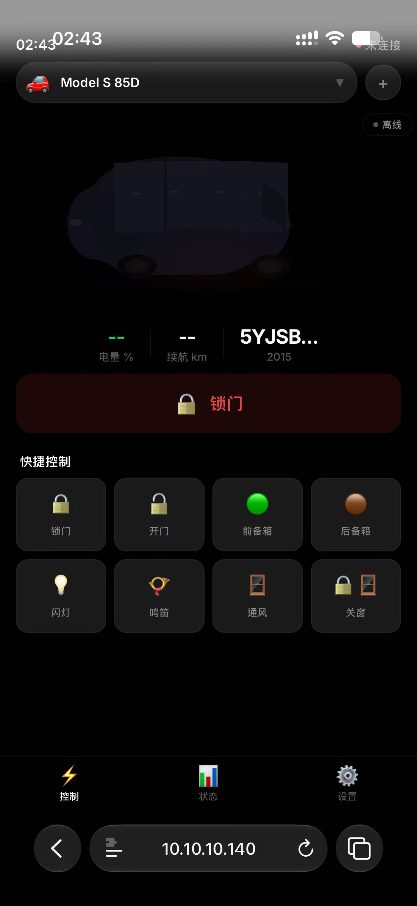

# 🚗 Tesla Model S CAN Server · Remote

<p align="center">
  
  
  
  
</p>

<p align="center">
  
</p>

> **[ English ]** · **[ 简体中文 ]** · **[ 日本語 ]** · **[ 한국어 ]**

---

**[English](#english) | [简体中文](#简体中文) | [日本語](#日本語) | [한국어](#한국어)**

---

<a name="english"></a>
## 🇺🇸 English

### The Story

I'm a Github-native open-source contributor with triple backgrounds: law, pure mathematics and full-stack engineering. Outside of coding and protocol reverse-engineering, I also work as an early-stage tech startup angel investor. I'm used to solving hardware and software ecosystem deadlocks with logical mathematical modeling, underlying network protocol analysis and legal compliance verification. I'm releasing this self-hosted Tesla vehicle control project not for showing off tech skills, but for a real, helpless user-side rescue against official service restrictions.

Let me start with the whole story, which will resonate with plenty of Tesla owners who have suffered the same official account ban issue. I own a rebuilt 2015 Tesla Model S 85D with a previous total loss record. I originally purchased this vehicle for 900,000 HKD before tax. This car has accompanied me through countless road trips and daily commutes, carrying tons of personal travel memories far beyond its material value.

After the total-loss accident, I independently invested another 130,000 HKD to complete full vehicle overhaul and hardware restoration. Every physical component of the car works perfectly and supports normal road driving. However, Tesla unilaterally suspended my official Tesla mobile app account and permanently cut off all cloud-based remote vehicle services, without any prior notice, reasonable official explanation or available appeal channels. Even though I am still the legal registered owner of this fully functional vehicle, I was stripped of all basic owner remote access privileges overnight.

Currently, the residual market value of this rebuilt old Model S is merely 150,000 HKD. From a pure asset investment perspective, abandoning this car would be the most rational choice. But vehicles carry emotions, not just market prices. I never violated any official user terms, and all I want is equal basic owner functions that every Tesla user deserves: remote door unlock when forgetting physical keys, pre-conditioning cabin temperature, real-time vehicle status check and fundamental remote body control. I don't need premium official cloud services; I only demand fair and basic ownership rights for my own car.

With no official support and no valid appeal path left, I decided to build an independent local control system completely out of Tesla's official cloud ecosystem. I got a free Orange Pi 4 Pro (6GB) SBC from a friend for hardware testing a while ago. My original plan for this single-board computer had nothing to do with vehicle remote control: I intended to build a vehicle-mounted lightweight NAS plus edge computing solution, leveraging its 3 TOPS AI computing power to realize local dashcam video storage and on-board vision edge AI analysis.

Given the complete shutdown of official app access, I restructured the whole solution rapidly. I adopt Orange Pi 4 Pro as the local core computing unit, connect to the vehicle's underlying CAN bus via CAN Server to realize direct hardware communication with the car, and deploy Tailscale to build secure private network penetration. The whole system runs 100% offline and self-hosted, with zero reliance on Tesla official cloud servers.

### Critical Notice

> ⚠️ **WORK IN PROGRESS** — This project is an unfinished work-in-progress prototype, not a stable production-ready solution.

As an open-source enthusiast who advocates community co-development, I open-source all my code and hardware wiring docs here for non-commercial communication only. This project has no intention to crack vehicle safety firmware or conduct illegal vehicle modification. I just want to communicate with fellow Tesla owners who have encountered arbitrary official account bans and service cuts, to figure out reliable self-hosted control workarounds together.

With solid legal awareness, rigorous mathematical logic and underlying engineering capabilities, I strictly limit this solution to legal self-owned vehicle local control only, without touching any core power and safety-related vehicle firmware. At the end of the day, it's simple: I own the car, so I should have the right to control my own car.

### The Stack

```
📱 Phone (PWA)
    ↓
🔗 Tailscale / WireGuard (encrypted P2P tunnel)
    ↓
🍊 Orange Pi 4 Pro (6GB RAM, ARM64 Linux)
    ├── Flask REST API (port 5000)
    ├── Python CAN driver (python-can + socketcan)
    ├── Tailscale client (always-on remote access)
    ├── DDNS updater (optional — remote.openfrunk.com)
    └── BLE beacon (local phone discovery)
    ↓
🔌 CANable 2.0 USB-CAN adapter
    └── OBD-II port → Vehicle Body CAN (125 kbps)
```

### Features

- 🔒 Lock / unlock doors via CAN bus
- 🟢 Open front trunk / 🟤 rear trunk
- 💡 Flash lights · 📯 Honk horn
- 🪟 Vent windows · ⚡ Charging control
- 📊 Real-time diagnostics (CAN / Bluetooth / 4G / Tailscale)
- 🚘 VIN decoder — 39 Tesla models database
- 🎨 Tesla + Material You style UI (dark theme)
- 🌐 Multi-language UI (ZH / EN / JA / KO)
- 📡 4 connection modes: Tailscale / DDNS / WiFi / BLE

### Hardware You'll Need

| Component | Est. Cost | Where |
|-----------|-----------|-------|
| Orange Pi 4 Pro / RPi 4 | ~¥300 | 淘宝 / Amazon |
| CANable 2.0 USB-CAN | ~¥45 | 淘宝 |
| OBD-II connector | ~¥20 | 淘宝 |
| 4G USB modem (opt.) | ~¥200 | Carrier |

### Quick Start

```bash
# 1. Flash Orange Pi 4 Pro with official Ubuntu 1.0.6 Jammy Server Linux image
# 2. Clone this repo
git clone https://github.com/Monah-Limited/Tesla-ModelS-CAN-Server-Remote.git
cd Tesla-ModelS-CAN-Server-Remote

# 3. Run one-click setup
bash setup_orangepi.sh

# 4. Wire CANable to OBD-II port
#    CAN_H → pin 1   CAN_L → pin 9   GND → pin 4

# 5. Start CAN interface
sudo slcand -o -c -s8 /dev/ttyACM0 can0
sudo ip link set can0 up type can bitrate 125000

# 6. Configure network (optional)
bash network/setup_network.sh
```

### Similar Projects

- [Open Vehicles](https://docs.openvehicles.com) — OVMS hardware module
- [Tesla Vehicle Command SDK](https://github.com/teslamotors/vehicle-command) — For 2021+ models with BLE support
- [Comma.ai OpenPilot](https://github.com/commaai/openpilot) — ADAS system

## 🙏 Credits / 致谢

This project would not exist without these open-source projects and communities:

| Project | What it does |
|---------|-------------|
| [**Open Vehicles**](https://docs.openvehicles.com) | OVMS — the original open-source Tesla CAN bus project. Massive inspiration. |
| [**CANable**](https://canable.io) | USB-to-CAN adapter firmware & hardware — the physical bridge to the car |
| [**candleLight firmware**](https://github.com/candle-usb/candleLight_fw) | Open-source CAN firmware running on CANable |
| [**python-can**](https://github.com/hardbyte/python-can) | Python CAN library |
| [**Flask**](https://flask.palletsprojects.com) | Web framework for the REST API server |
| [**Tailscale**](https://tailscale.com) | Zero-config VPN — secure remote access to the car |
| [**Orange Pi 4 Pro**](http://www.orangepi.org) | The SBC running the server (Raspberry Pi alternative) |
| [**Tesla Vehicle Command SDK**](https://github.com/teslamotors/vehicle-command) | Tesla's official BLE/cloud API for 2021+ models |
| [**Comma.ai OpenPilot**](https://github.com/commaai/openpilot) | ADAS system — pushing the boundaries of what's possible with cars |
| [**OpenGarages**](https://opengarages.org) | Community of hackers reverse-engineering vehicle protocols |

**Special thanks** to the reverse-engineering community on [Tesla Motors Club](https://teslamotorsclub.com) and the CAN bus hacking forums — the collective knowledge that made this possible.

### License

MIT — do whatever you want. Just don't sue me if your car does something unexpected. This is a side project, not a product.

---

<a name="简体中文"></a>
## 🇨🇳 简体中文

### 故事的起点

大家好，我是一名常年泡在Github开源社区的独立开发者，同时拥有法律、纯数学以及全栈技术三重学术背景，日常也做早期科技初创公司的天使投资，习惯用逻辑推演、底层代码拆解以及合规层面的双向思维，去解决各类硬件与软件的闭环问题。今天开源这套基于香橙派搭建的特斯拉自研车机控制系统，没有炫技的意思，纯粹是一次被逼无奈、为爱发电的底层技术自救。

先聊聊整件事的起因，相信很多特斯拉车主都能狠狠共情。我的座驾是2015款全损修复版 Tesla Model S 85D，当年落地不含税费的购入成本高达90万港币，这台车陪我走过了无数通勤、长途自驾的日夜，承载了非常多私人出行回忆，对我而言从来不是一台单纯的代步机器。

车辆发生全损事故之后，我自掏腰包花费13万港币全额完成整车修复，整车硬件工况全部恢复正常，车辆本身完全可以正常上路使用。但让我无法理解也无法接受的是：特斯拉官方直接单方面封禁了我的车主APP账号，永久关停了云端所有官方远程控制服务。没有任何协商空间，没有合规层面的合理解释，哪怕车辆硬件完好、我依旧是合法登记的车主，我彻底失去了所有车主标配的远程控车权限。

如今这台修复完毕的老款Model S 85D二手残值仅仅只剩15万港币，从资产价值来看，放弃它看似是最理性的选择。但情怀从来不能用二手车估值衡量，我从头到尾没有任何出格操作，只是想要拿回每一位特斯拉车主本该平等拥有的基础功能：忘带车钥匙时远程解锁、提前开启空调、查看车辆状态、基础远程车身控制。我不需要官方云端的增值服务，我只想要属于我自己车辆最基础、最公平的车主权益。

在官方彻底切断云端通路、没有任何申诉渠道之后，我决定不走官方生态，自己从零搭建一套本地化控车方案。刚好前段时间朋友赠予我一块闲置的Orange Pi 4 Pro（6GB）开发板，最初拿到这块板子的规划和本次控车项目完全无关：我原本计划依托这块开发板3TOPS的算力，搭建一台小型车载NAS+边缘计算设备，专门做特斯拉行车记录仪视频本地存储、车载画面AI边缘识别分析，只是单纯想做一个轻量化车载边缘算力玩机项目。

恰逢官方账号被封无路可走，我顺势调整了整体方案架构：以Orange Pi 4 Pro为本地核心算力主机，通过CAN Server直连车辆CAN总线，打通车辆底层硬件通讯协议，再搭配Tailscale搭建私有内网穿透通道，完全脱离特斯拉官方云端服务器，自建一套私有化、无第三方依赖的远程车辆控制系统。

### 重要前置声明

> ⚠️ **未完成半成品** — 本项目目前依旧是未完成测试半成品，绝非成熟商用方案。

作为一名习惯开源共建的Github爱好者，我把整个项目开源出来，不是为了破解、篡改车辆安全底层协议，也不是用于任何违规改装用途。我只是想和圈内同样遭遇官方账号封禁、被官方一刀切关停APP服务的特斯拉车主，一起交流底层CAN总线通讯逻辑、私有内网控车方案，抱团解决官方服务霸权带来的用车痛点。

我懂法律合规边界，懂数学逻辑建模，也懂车载底层硬件与网络架构，所以整套方案全程恪守车辆安全底线与相关合规要求，只做车主合法自有车辆的本地私有化控制，不触碰任何车辆动力安全底层固件。说到底，一个很朴素的心愿：我的车，我自己做主。

### 架构

```
📱 手机 (PWA)
    ↓
🔗 Tailscale / WireGuard (加密 P2P 隧道)
    ↓
🍊 Orange Pi 4 Pro (6GB RAM, ARM64 Linux)
    ├── Flask REST API (端口 5000)
    ├── Python CAN 驱动 (python-can + socketcan)
    ├── Tailscale 客户端 (常驻在线)
    ├── DDNS 更新器 (可选 — remote.openfrunk.com)
    └── BLE 信标 (本地手机发现)
    ↓
🔌 CANable 2.0 USB-CAN 适配器
    └── OBD-II 接口 → 车身 CAN 总线 (125 kbps)
```

### 功能

- 🔒 通过 CAN 总线锁定/解锁车门
- 🟢 开启前备箱 / 🟤 后备箱
- 💡 闪灯 · 📯 鸣笛
- 🪟 车窗通风 · ⚡ 充电控制
- 📊 实时诊断（CAN / 蓝牙 / 4G / Tailscale）
- 🚘 VIN 解码器 — 39 款 Tesla 车型数据库
- 🎨 Tesla + Material You 风格 UI（深色主题）
- 🌐 多语言界面（中文 / 英文 / 日文 / 韩文）
- 📡 四种连接模式：Tailscale / DDNS / WiFi / BLE

### 所需硬件

| 组件 | 预估成本 | 购买渠道 |
|------|---------|---------|
| Orange Pi 4 Pro / 树莓派 4 | ~¥300 | 淘宝 / Amazon |
| CANable 2.0 USB-CAN | ~¥45 | 淘宝 |
| OBD-II 连接器 | ~¥20 | 淘宝 |
| 4G USB 上网卡（可选） | ~¥200 | 运营商 |

### 快速开始

```bash
# 1. 为 Orange Pi 4 Pro 刷入官方 Ubuntu 1.0.6 Jammy Server Linux 镜像
# 2. 克隆仓库
git clone https://github.com/Monah-Limited/Tesla-ModelS-CAN-Server-Remote.git
cd Tesla-ModelS-CAN-Server-Remote

# 3. 运行一键部署脚本
bash setup_orangepi.sh

# 4. 连接 CANable 到 OBD-II 接口
#    CAN_H → pin 1   CAN_L → pin 9   GND → pin 4

# 5. 启动 CAN 接口
sudo slcand -o -c -s8 /dev/ttyACM0 can0
sudo ip link set can0 up type can bitrate 125000

# 6. （可选）配置网络层
bash network/setup_network.sh
```

### 同类项目

- [Open Vehicles](https://docs.openvehicles.com) — OVMS 硬件模块
- [Tesla Vehicle Command SDK](https://github.com/teslamotors/vehicle-command) — 适用于 2021+ 支持 BLE 的车型
- [Comma.ai OpenPilot](https://github.com/commaai/openpilot) — ADAS 系统

### 许可证

MIT — 随便用。只是别因为你的车出了意外来起诉我。这是个人项目，不是商业产品。

---

<a name="日本語"></a>
## 🇯🇵 日本語

### プロジェクトの背景

私はGitHubで長年活動するオープンソース愛好家であり、法学、純粋数学、フルスタック開発の三つの専門背景を持っています。普段はテック系スタートアップのエンジェル投資も行っており、数学的論理推論、下位プロトコル解析、法的コンプライアンスの三軸から、ソフトウェアとハードウェアのエコシステム課題を解決することを得意としています。今回オレンジパイを活用したテスラ自前車両制御システムを公開したのは、技術自慢ではなく、公式クラウドサービスの一方的な制限に対する、ユーザーとしての自力救済です。

まずプロジェクトの発端を説明します。同じ被害に遭ったテスラオーナーの方なら強く共感できるはずです。私の愛車は事故歴あり全損修理済みの2015年式 Tesla Model S 85Dで、購入時の税抜価格は90万香港ドルに達しました。この車は長年の通勤や長距離ドライブを共に過ごし、単なる移動手段を超えた多くの思い出を詰め込んでいます。

全損事故後、私自身で13万香港ドルを投じて車両を完全に修理し、全てのハードウェアを正常な状態に復旧させ、公道走行に全く問題がない状態に戻しました。しかしテスラ公式側は事前通知も説明もなく、私の公式アプリアカウントを一方的に凍結し、全てのクラウド遠隔制御サービスを永久停止しました。車両の登録名義は私のままで完全な合法所有者であるにもかかわらず、標準のオーナー権限を一切剥奪されました。

現在の修理済み車両の中古残価はわずか15万香港ドルまで下落しています。資産価値だけで判断すれば手放すのが合理的な選択ですが、車に宿る思い出は金額で測れません。私は利用規約に一切違反しておらず、求めているのは全てのテスラオーナーが平等に享受できる基本機能だけです：鍵を忘れた時の遠隔解錠、乗車前の空調事前起動、車両状態の確認など、最低限の権利のみです。有料のプレミアムクラウドサービスは必要なく、自分の車に対する正当な所有者権利が欲しいだけです。

公式サポートと異議申し立て経路が完全に遮断されたため、テスラ公式クラウドに依存しない自前のローカル制御システムを一から構築することを決めました。以前友人からテスト用に譲り受けた Orange Pi 4 Pro (6GB) を活用しています。当初このボードは車載NASとエッジコンピューティング機器として開発予定で、3TOPSのAI演算能力を活用し、ドライブレコーダー映像のローカル保存と車載画像AI分析を行う趣味プロジェクトを計画していました。

アプリサービス停止をきっかけにシステム構成を再設計しました。Orange Pi 4 Proをローカル演算コアとし、CAN Serverを介して車両CANバスに直接接続し、車両下位通信プロトコルと通信を確立。さらにTailscaleでプライベートVPNトンネルを構築し、完全にテスラ公式クラウドを経由せず、第三者依存のない自前遠隔制御環境を実現しました。

> **⚠️ 重要告知** — 本プロジェクトは未完成の試作プロトタイプであり、安定した製品版ではありません。

オープンソースコミュニティの共開発理念に基づき、コードと配線資料を公開しています。本プロジェクトは車両安全ファームウェアのクラッキングや違法改造を目的としたものではなく、公式の一方的なアカウント停止被害に遭ったオーナー同士で、安全な自前制御の代替案を情報共有するためのものです。

法的知識、数学的論理、下位技術開発の三つの強みを活かし、本システムは自身の合法車両のローカル制御に限定し、車両の動力・安全に関わるコアファームウェアには一切触れていません。最後に一言：自分が所有する車は、自分自身で制御する権利があるはずです。

---

<a name="한국어"></a>
## 🇰🇷 한국어

### 프로젝트의 배경

저는 깃허브에서 오랜 기간 활동하는 오픈소스 개발자이며 법학, 순수수학, 풀스택 엔지니어링의 복합 전공 배경을 갖고 있습니다. 평소 테크 스타트업 초기단계 엔젤 투자도 병행하고 있으며 수학적 논리 분석, 하위 네트워크 프로토콜 해석, 법적 컴플라이언스 검토를 바탕으로 생태계 소프트웨어 및 하드웨어 문제를 해결하는 것을 주로 하고 있습니다. 이번 테슬라 자체 호스팅 차량 제어 프로젝트를 공개한 이유는 기술 자랑이 아니라, 플랫폼 기업의 일방적인 서비스 제한에 대한 사용자 차원의 기술적 자구책입니다.

프로젝트의 배경을 설명드리며, 동일한 피해를 입은 테슬라 차주분들께 충분한 공감을 드리고 싶습니다. 제 차량은 사고 후 전손 복구를 마친 2015년식 테슬라 모델 S 85D입니다. 차량 구매 당시 세전 가격은 90만 홍콩달러에 달했고, 수많은 통근 및 장거리 주행을 함께하며 단순한 이동 수단 이상의 추억을 담고 있습니다.

전손 사고 발생 후 저는 직접 13만 홍콩달러를 투자해 차량 전체를 완벽하게 복원했으며, 모든 하드웨어 부품은 정상 작동하고 도로 주행에 전혀 문제가 없습니다. 하지만 테슬라 본사는 사전 고지나 합리적인 설명 없이 제 공식 앱 계정을 일방적으로 정지시키고 모든 클라우드 원격 제어 서비스를 영구적으로 차단했습니다. 저는 여전히 차량의 합법적인 등록 소유자임에도 불구하고, 기본적인 차주 원격 제어 권한을 모두 박탈당했습니다.

현재 복구된 차량의 중고 잔존 가치는 단 15만 홍콩달러밖에 되지 않습니다. 자산 관점에서만 보면 차량을 처분하는 것이 가장 합리적인 선택이지만, 차량에 담긴 추억은 금액으로 환산할 수 없습니다. 저는 테슬라 이용 약관을 위반한 적이 전혀 없으며, 단지 모든 테슬라 차주가 평등하게 누려야 할 기본 기능만을 원합니다: 키를 분실했을 때 원격 잠금 해제, 탑승 전 차량 공조 예약, 실시간 차량 상태 확인 등 기본적인 소유권 기능만 요구할 뿐 프리미엄 클라우드 유료 서비스는 필요하지 않습니다.

공식 지원 및 이의 제기 통로가 완전히 막혀 테슬라 공식 클라우드에 의존하지 않는 독립형 로컬 제어 시스템을 직접 구축했습니다. 얼마 전 지인으로부터 테스트용 Orange Pi 4 Pro (6GB) 싱글보드 컴퓨터를 제공받았으며, 원래 계획은 해당 보드의 3TOPS AI 연산 성능을 활용해 차량용 소형 NAS 및 엣지 컴퓨팅 장치를 제작해 블랙박스 영상 로컬 저장 및 차량 영상 AI 분석을 진행하는 취미 프로젝트였습니다.

앱 서비스 차단 사태를 계기로 시스템 아키텍처를 재설계했습니다. Orange Pi 4 Pro를 로컬 핵심 연산 장치로 사용하고 CAN 서버를 통해 차량 CAN 버스에 직접 연결해 차량 하위 통신 프로토콜과 연동했으며, 테일스케일(Tailscale)로 안전한 사설 네트워크 터널을 구축했습니다. 전체 시스템은 테슬라 공식 클라우드 서버를 전혀 거치지 않고 100% 자체 호스팅으로 운영됩니다.

> **⚠️ 중요 공지** — 본 프로젝트는 아직 완성되지 않은 진행 중인 프로토타입이며 안정적인 상용 솔루션이 아닙니다.

오픈소스 커뮤니티 공동 개발 취지에 따라 모든 소스코드와 하드웨어 배선 문서를 비상업적 목적으로 공개했습니다. 본 프로젝트는 차량 안전 펌웨어 크래킹이나 불법 차량 개조를 목적으로 하지 않으며, 플랫폼의 일방적인 계정 정지 피해를 입은 차주들끼리 안전한 자체 제어 방안을 공유하기 위한 목적만 갖고 있습니다.

법률 지식, 수학적 논리, 하위 시스템 개발 역량을 바탕으로 본 솔루션은 본인 소유의 합법 차량 로컬 제어에만 국한되며 차량 동력 및 안전 관련 핵심 펌웨어에는 일절 접근하지 않았습니다. 결국 가장 간단한 명제입니다: 내가 소유한 차는 내가 직접 제어할 권리가 있습니다.

---

## 📁 Project Structure

```
tesla-local-control/
├── app/
│   ├── tesla_can.py          # CAN bus driver (socketcan interface)
│   ├── tesla_models.py       # 39 Tesla models database + VIN decoder
│   ├── server.py             # Flask REST API server
│   └── static/index.html     # PWA mobile app (4-language UI)
├── network/
│   ├── setup_4g_modem.sh     # 4G/5G modem configuration
│   ├── setup_network.sh      # Tailscale + DDNS + BLE
│   └── ddns_update.sh        # DDNS periodic updater
├── setup_orangepi.sh         # One-click deployment
├── wiring.md                 # OBD-II wiring guide
├── ARCHITECTURE.md           # Architecture diagram
└── LICENSE                   # MIT
```

---

## 👤 About the Author

Tim holds a law degree, an actuarial science degree, and is a self-taught programmer with a passion for Vibe Coding and AI.

This repo is a conversation starter, not a product pitch. PRs welcome. Issues welcome. Ideas welcome. Let's build together.

---

<p align="center">
  <sub>Built with ☕ and stubbornness in Hong Kong SAR</sub>
</p>
